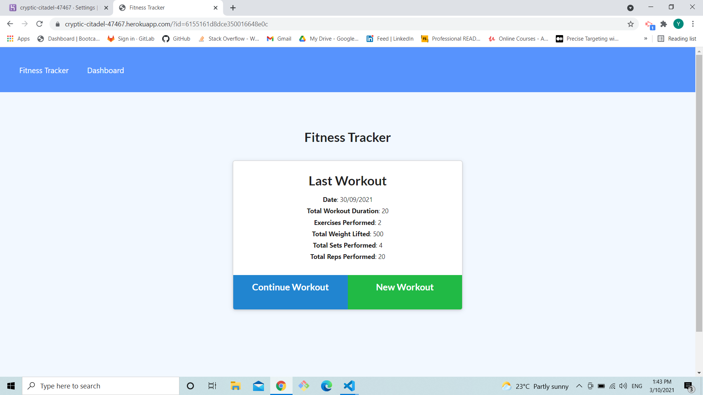
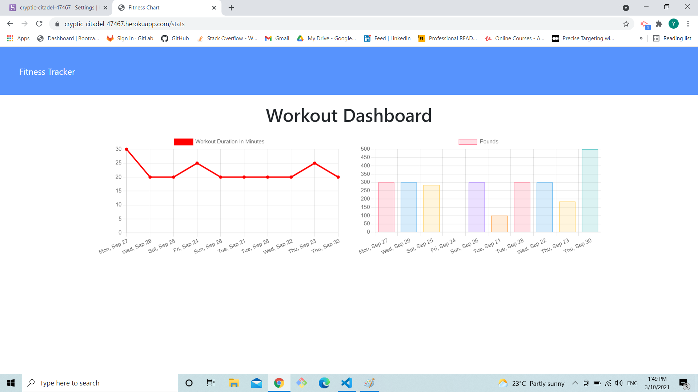
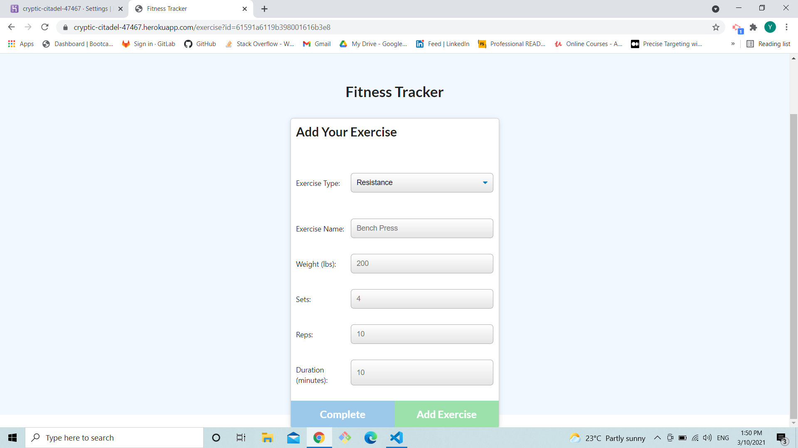

# Unit 18 Nosql Homework: Workout Tracker

## Task
In this weeks homework a workout tracker that is able to track workouts and graph the data was to be finished 
## URL

https://cryptic-citadel-47467.herokuapp.com/

## Work

1. when the page is first loaded a information of the previous workout and button are loaded

2. when dashboard is clicked a graph is shown with the previous workout data.

3. when the user clicks new workout button a form pops up with inputs.

4. when user completes the new workout,the data is created and saved in database. 

